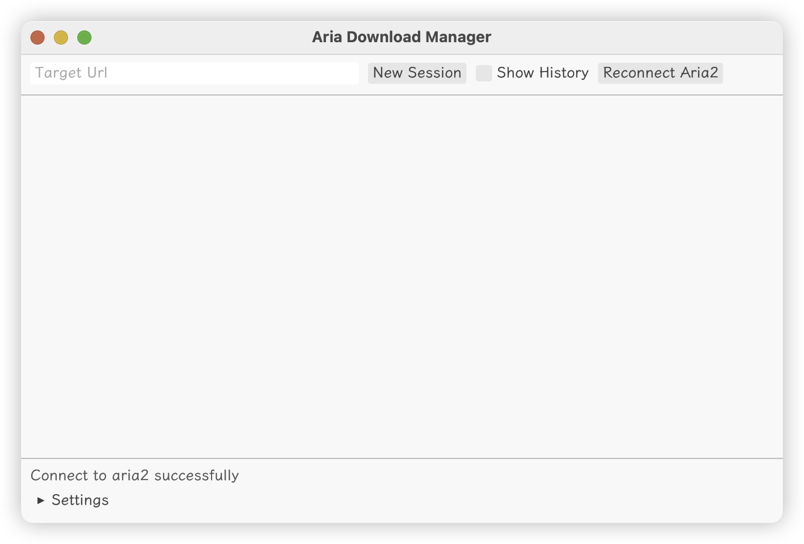

<p align="center">
<a href="./assets/icon.raw.png">

</a>
<h3 align="center">Aria Download Manager</h3>
<p align="center">A download manager designed for macOS and based on aria2. </p>
</p>
<p align="center">
<a href="./README_zh.md">中文</a> | <a href="./README.md">English</a>
</p>

## Show


## Requirements
* rust `>= 1.74.0`
* aria2

## Build
1. Clone the repo.
```shell
git clone https://github.com/iewnfod/aria-download-manager.git
```
2. Run build script.
```shell
scripts/build.sh
```
3. You can find `.app` and `.dmg` file in target dir.

## Develop
### Adm Tray
1. Build a debug binary of download manager use `cargo build`.
2. Move it into adm-tray's target dir.
3. Enter adm-tray's dir and use `cargo run` to run your codes.
### Aria Download Manager
1. Open this application or adm-tray binary to make sure that aria2 has been started.
2. Use `cargo run` to run your codes.
